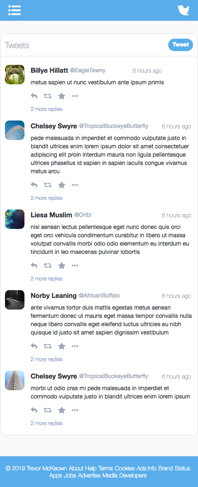
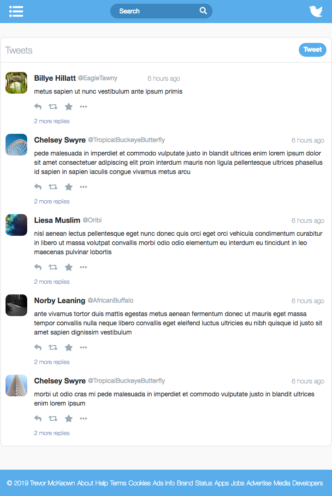

# Twitter Clone
[](https://app.circleci.com/pipelines/github/mcknasty)
[](https://codecov.io/gh/mcknasty/twitter-angular-clone.github.io)
[](https://github.com/mcknasty/twitter-angular-clone.github.io/actions/workflows/codeql-analysis.yml)
[](https://lgtm.com/projects/g/mcknasty/twitter-angular-clone.github.io/context:javascript)
[](https://lgtm.com/projects/g/mcknasty/twitter-angular-clone.github.io/alerts/)


This project's initial template was generated with [Angular CLI](https://github.com/angular/angular-cli) version 7.3.6.

## About
This project was created with the following features:

  - Mobile first css framework. Views for [desktop](#desktop), [tablet](#tablet) and [mobile devices](#phone). :thumbsup:
  - [Angular 13 typescript framework](https://angular.io/). :thumbsup:
  - [Angular Animations](https://angular.io/guide/animations). :thumbsup:
  - [CSS Flex container layouts](https://css-tricks.com/snippets/css/a-guide-to-flexbox/). :thumbsup:
  - [Font Awesome Icons](https://github.com/FortAwesome/Font-Awesome). :thumbsup:
  - [SCSS style sheets](https://sass-lang.com/). :thumbsup:
  - [In memory Web Api](https://github.com/angular/in-memory-web-api). :thumbsup:

## Live Example
  [To see a live example of this demo, please follow this link](https://mcknasty.github.io/twitter-angular-clone.github.io). To add a new tweet click the tweet button at the top of the tweet feed.  To see another users feed click on any of the handles in the tweets

## Working with this project
Install angular cli with the following command:
```
 npm install -g @angular/cli
```

Clone the project to a convenient directory path then change into the repository's directories
```
  git clone git@github.com:mcknasty/twitter-angular-clone.github.io.git
  cd twitter-angular-clone.github.io
```

Install the node module dependencies
```
npm install
```

### Development server

Run `npm run start` from with in the repository directory for a dev server. Navigate to `http://localhost:4200/`. The app will automatically reload if you change any of the source files. Note if you are running inside a virtual machine or a docker container you might to forward some ports in order to access the above url.

### Running Unit Tests
Run `npm run test`

### Build

Run `npm run build` from the root repository directory to build the project. The build artifacts will be stored in the `dist/` directory. Use the `--prod` flag for a production build.

## Screenshots

### Phone
  

### Tablet
  

### Desktop ###
  
